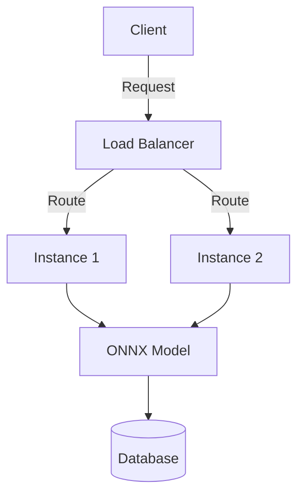

# 🚀 Churn Prediction API

API untuk memprediksi kemungkinan pelanggan berhenti berlangganan (churn) menggunakan model machine learning berbasis ONNX.

## 🔧 Teknologi Utama
- **Python** 3.9+
- **FastAPI** (Backend)
- **ONNX Runtime** (Inference Model)
- **Railway** (Deployment)
- **k6** (Load Testing)

## 📦 Instalasi

### 1. Clone Repository
```bash
git clone https://github.com/username/churn-model-api.git
cd churn-model-api
```

### 2. Setup Virtual Environment
```bash
python -m venv venv
source venv/bin/activate  # Linux/Mac
.\venv\Scripts\activate   # Windows
```

### 3. Install Dependencies
```bash
pip install -r requirements.txt
```

## 🏃‍♂️ Menjalankan API Lokal
```bash
uvicorn main:app --reload
```
Akses dokumentasi API: http://localhost:8000/docs

## 🌐 Endpoint
| Method | Endpoint    | Deskripsi                     |
|--------|------------|-------------------------------|
| GET    | `/`        | Homepage                      |
| POST   | `/predict` | Prediksi churn pelanggan       |
| GET    | `/performance` | Monitoring performa server |

**Contoh Request**:
```json
{
  "features": [0, 0, 1, 0, 45, 1, 0, 2, 0, 0, 0, 0, 0, 0, 1, 1, 2, 89.85, 4034.45]
}
```

**Contoh Response**:
```json
{
  "prediction": 0,
  "probability": 0.7834,
  "status": "Not Churn",
  "handled_by": "serverless-instance-123"
}
```

## 🚄 Deployment di Railway
1. Buat project baru di [Railway.app](https://railway.app)
2. Connect ke repository GitHub Anda
3. Atur environment variables:
   ```env
   PORT=8000
   RAILWAY_ENVIRONMENT=production
   ```
4. Aktifkan auto-scaling di dashboard Railway

## 📊 Load Testing dengan k6
### Instal k6
```bash
brew install k6  # Mac
choco install k6 # Windows
```

### Jalankan Test
```bash
k6 run tests/load-test.js
```

**Contoh Skrip Test** (`tests/load-test.js`):
```javascript
import http from 'k6/http';

export const options = {
  stages: [
    { duration: '30s', target: 50 },
    { duration: '1m', target: 100 }
  ]
};

export default function () {
  const payload = JSON.stringify({
    features: [0, 0, 1, 0, 45, 1, 0, 2, 0, 0, 0, 0, 0, 0, 1, 1, 2, 89.85, 4034.45]
  });
  
  http.post('https://api-anda.com/predict', payload, {
    headers: { 'Content-Type': 'application/json' }
  });
}
```

## 📈 Arsitektur


## 🛠️ Fitur Khusus
- **Auto-scaling** di Railway
- **Performance comparison** endpoint
- **Logging** instance handler
- **Validation** input otomatis

## 📄 License
MIT License - [LICENSE](LICENSE)

---
🛠️ Maintained by [Your Name] | 📧 your.email@example.com
```

### Fitur README.md ini:
1. **Instalasi** lengkap dari clone sampai running
2. **Dokumentasi API** dengan contoh request/response
3. **Panduan deployment** di Railway
4. **Load testing** dengan k6
5. **Diagram arsitektur** sederhana
6. **License** dan kontak

Anda bisa menyesuaikan:
- Nama repository di URL clone
- Detail kontak maintainer
- Contoh payload sesuai model Anda
- Konfigurasi k6 untuk skenario spesifik