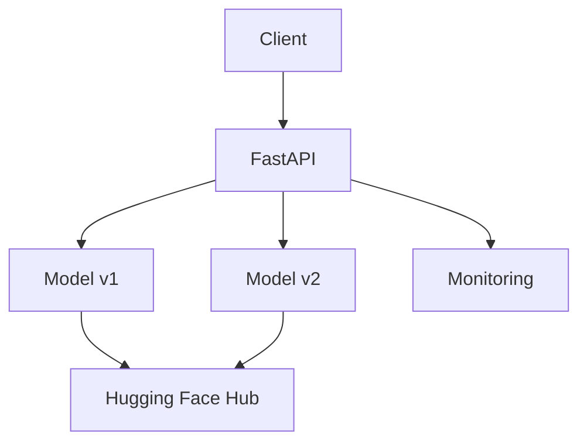

# 🚀 Churn Prediction API (Multi-Model Version)

API untuk memprediksi kemungkinan pelanggan berhenti berlangganan (churn) dengan dukungan multi-versi model ONNX.

## 🔧 Teknologi Utama
- **Python** 3.9+
- **FastAPI** (Backend)
- **ONNX Runtime** (Inference)
- **Hugging Face Hub** (Model Storage)
- **Railway** (Deployment)

## 📦 Instalasi

### 1. Clone Repository
```bash
git clone https://github.com/username/churn-model-api.git
cd churn-model-api
```

### 2. Setup Environment
```bash
python -m venv venv
source venv/bin/activate  # Linux/Mac
.\venv\Scripts\activate   # Windows
```

### 3. Install Dependencies
```bash
pip install -r requirements.txt
```

## 🏃‍♂️ Menjalankan API
```bash
uvicorn app.main:app --reload
```
Akses dokumentasi: http://localhost:8000/docs

## 🌐 Endpoint Utama

### Prediksi
| Method | Endpoint            | Deskripsi                     |
|--------|--------------------|-------------------------------|
| POST   | `/predict/{version}` | Prediksi churn dengan versi tertentu |

**Contoh Request**:
```bash
POST /predict/v1
{
  "features": [0,0,1,0,45,1,0,2,0,0,0,0,0,0,1,1,2,89.85,4034.45]
}
```

**Response**:
```json
{
  "prediction": 0,
  "probability": 0.7834,
  "status": "Not Churn",
  "model_version": "v1",
  "handled_by": "server-instance-1"
}
```

### Monitoring
| Method | Endpoint          | Deskripsi           |
|--------|------------------|---------------------|
| GET    | `/monitor/performance` | Statistik performa |

**Response**:
```json
{
  "serverless": {
    "avg": 0.125,
    "min": 0.100,
    "max": 0.150,
    "count": 42
  },
  "non_serverless": {
    "avg": 0.115,
    "min": 0.095,
    "max": 0.140,
    "count": 35
  }
}
```

## 🚄 Deployment di Railway
1. Buat project baru di [Railway.app](https://railway.app)
2. Connect ke repository GitHub
3. Atur environment variables:
   ```env
   PORT=8000
   RAILWAY_ENVIRONMENT=production
   ```

## 🧪 Testing
### Unit Test
```bash
pytest tests/
```

### Load Test (k6)
```bash
k6 run tests/load-test.js
```

Contoh skrip load test:
```javascript
import http from 'k6/http';

export const options = {
  stages: [
    { duration: '30s', target: 50 },
    { duration: '1m', target: 100 }
  ]
};

export default function () {
  const payload = JSON.stringify({
    features: [0,0,1,0,45,1,0,2,0,0,0,0,0,0,1,1,2,89.85,4034.45]
  });
  
  http.post('http://localhost:8000/predict/v1', payload, {
    headers: { 'Content-Type': 'application/json' }
  });
}
```

## 📈 Arsitektur


## 🛠️ Fitur Khusus
- Multi-versi model (v1, v2, dst)
- Auto-download model dari Hugging Face
- Performance tracking per versi
- Instance awareness

## 📄 License
MIT License - [LICENSE](LICENSE)

---
🛠️ Maintained by [Your Name] | 📧 your.email@example.com
```

Perubahan utama dari versi sebelumnya:
1. Memperbarui endpoint sesuai router (`/predict/{version}`, `/monitor/performance`)
2. Menambahkan dokumentasi multi-versi model
3. Memperbarui contoh request/response
4. Menyesuaikan diagram arsitektur
5. Menambahkan informasi tentang auto-download dari Hugging Face Hub

Anda bisa menyesuaikan:
- URL repository GitHub
- Detail kontak maintainer
- Contoh payload sesuai kebutuhan model
- Konfigurasi load testing